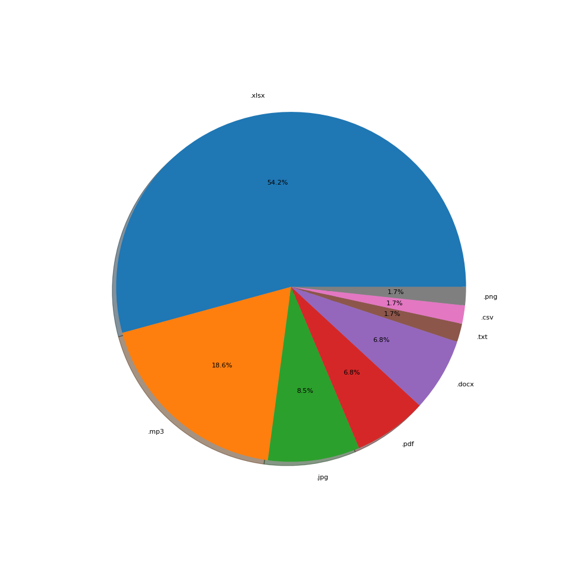

# File-Handling
A python project that handle your files in a given directory.
I tried to handle the most conventional file types like:
-.png
-.csv
-.pdf
-.xlsx
-.exe
-.zip
-.jpg
-.docx
-.pptx
-.txt
-.rar
-.json
-.mpp
-.py
-.mp3
-.mp4

## How To Run
First add the `src` to `PYTHONPATH`. If you don't know how to do it, write this command in your terminal:

```
export PYTHONPATH=${PWD}
```

Then run:

```
python src/main.py
```

## An example of the detail of my own messy directory
You can see the pie chart of one of my directories:

